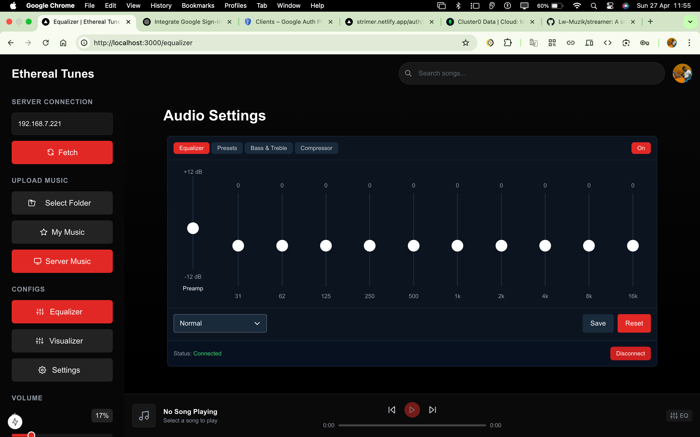

# Streamer - Music Streaming Platform

[](https://app.netlify.com/sites/strimer/deploys)



A modern music streaming platform built with Next.js, featuring authentication, music metadata handling, and a responsive UI.

## 🚀 Features

- Modern Next.js 15 application with TypeScript
- Authentication system with NextAuth.js
- MongoDB integration for data persistence
- Redux state management
- Tailwind CSS for styling
- Music metadata processing
- Responsive design

## 🛠️ Tech Stack

- **Framework:** Next.js 15
- **Language:** TypeScript
- **Styling:** Tailwind CSS
- **State Management:** Redux Toolkit
- **Database:** MongoDB
- **Authentication:** NextAuth.js
- **UI Components:** Lucide React

## 📋 Prerequisites

- Node.js (Latest LTS version recommended)
- MongoDB instance
- npm or yarn package manager

## 🚀 Getting Started

1. **Clone the repository**
   ```bash
   git clone https://github.com/yourusername/streamer.git
   cd streamer
   ```

2. **Install dependencies**
   ```bash
   npm install
   # or
   yarn install
   ```

3. **Set up environment variables**
   Create a `.env.local` file in the root directory with the following variables:
   ```
   MONGODB_URI=your_mongodb_connection_string
   NEXTAUTH_SECRET=your_nextauth_secret
   NEXTAUTH_URL=http://localhost:3000
   ```

4. **Run the development server**
   ```bash
   npm run dev
   # or
   yarn dev
   ```

5. Open [http://localhost:3000](http://localhost:3000) in your browser to see the application.

## 🏗️ Project Structure

```
streamer/
├── app/              # Next.js app directory
├── components/       # React components
├── contexts/         # React contexts
├── hooks/            # Custom React hooks
├── lib/              # Utility libraries
├── providers/        # Context providers
├── public/           # Static assets
├── schema/           # Database schemas
├── store/            # Redux store
├── types/            # TypeScript type definitions
└── utils/            # Utility functions
```

## 🤝 Contributing

We welcome contributions! Here's how you can help:

1. Fork the repository
2. Create your feature branch (`git checkout -b feature/amazing-feature`)
3. Commit your changes (`git commit -m 'Add some amazing feature'`)
4. Push to the branch (`git push origin feature/amazing-feature`)
5. Open a Pull Request

### Development Guidelines

- Follow TypeScript best practices
- Write meaningful commit messages
- Keep components modular and reusable
- Add appropriate tests for new features
- Update documentation as needed

## 📝 License

This project is licensed under the MIT License - see the [LICENSE](LICENSE) file for details.

## 🙏 Acknowledgments

- [Next.js](https://nextjs.org/)
- [Tailwind CSS](https://tailwindcss.com/)
- [NextAuth.js](https://next-auth.js.org/)
- [Redux Toolkit](https://redux-toolkit.js.org/)
- [MongoDB](https://www.mongodb.com/)

## 📞 Support

For support, please open an issue in the GitHub repository or contact the maintainers.

---

## Made with ❤️ by COTE TECH
